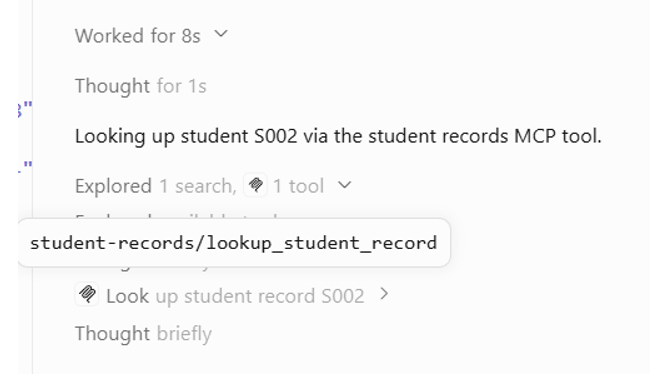

# Lab 3 — Starter

Configuring and using MCP servers in an IDE. See the lab handout
(`lab-03.pdf`) for the full walkthrough.

## What's here in starter
- `mcp.json.example.json` — config template registering three servers: `filesystem`, `github`,
  and your own `student-records`. Replace `location_of_your_xxxx` with your real path.
- `mcp_template/server.py` — **skeleton** custom MCP server. Fill in the `TODO` in
  `lookup_student_record`, then point `mcp.json` at this file.
- `mcp_template/students.csv` — the data your tool reads.
- `geom/` — a tiny package whose `area_of_circle` function you will rename to
  `circle_area` via the agent (see `TASK.md`).
- `TASK.md` — the integrated refactoring brief.

## External (npm) servers — not in this repo
The `filesystem` and `github` servers are **reference MCP servers published as npm
packages**; they are *not* embedded here. The IDE downloads and runs them on demand
via `npx`, so you need Node.js installed:

```bash
node --version                                   # need Node 18+
npx -y @modelcontextprotocol/server-filesystem@2026.1.14 --help
npx -y @modelcontextprotocol/server-github@2025.4.8 --help
```

## GitHub Token
The GitHub server reads a **personal access token** from the `GITHUB_TOKEN` env var
(referenced as `${env:GITHUB_TOKEN}` in `mcp.json`). 

Create one at
[https://github.com/settings/tokens](github.com/settings/tokens) with `repo` scope and export it in your shell profile.

1. In `Personal access tokens (classic)` or `Tokens (classic)`, click `Generate new token (classic)`.
2. Name the token in the `Note` (e.g., lab03_token).
3. Select `repo` in the scopes.
4. Click `Generate token`.
5. Save the token.

**Remember: never paste the token into `mcp.json`**.

## Setup
**In Anaconda Prompt**
```bash
D:
git clone https://github.com/comp0000-fa26/lab03-starter.git
cd lab03-starter
python -m venv .venv
.venv\Scripts\activate
pip install mcp
```

**Go to [Cursor](https://cursor.com/download) to download it if the lab machine doesn't have one.**

## Setup MCP in Cursor
1. Open Cursor and click `IDE` on the top right corner.

2. Copy `mcp.json.example.json` into Cursor's `mcp.json`. You can open it from:
  
  - Click `Settings` icon on top left corner -> Select `Tools & MCPs`-> Select `Add Custom MCP`

3. Replace `location_of_your_lab03-starter` with your actual file path.

    > **Tip**: Typically, these paths should look like `D:\\lab03-starter` and `D:\\lab03-starter\\mcp_template\\server.py`.

4. Use `Ctrl + J` or click `New Terminal` in `Terminal` tab. Set your GitHub Token with `SETX GITHUB_TOKEN_LAB03 "..."` in your shell profile.

6. Restart the Cursor; verify all three servers appear in the `MCP Servers` area with green light in `Tools & MCPs`.
    > You can check your GitHub Token with `$env:GITHUB_TOKEN_LAB03` in the Terminal after restart 


## Handshaking in MCP
You can see the handshaking between the server and the client in Cursor after finishing the MCP setup.

1. Select the `Output` tab in the terminal.

2. Choose `MCP Logs` from the dropdown list.

3. You can find the logs from the MCP. You will see the `statusType` change from `initializing` to `connected`, which means the handshaking is completed.

> **Note:** If you cannot see any logs in the tab, try deleting all the code in your mcp.json file and saving it. Afterward, press Ctrl + Z to restore the code and save it again.

In `MCP Logs`, e.g., 
```bash
2026-07-23 16:56:10.550 [info] [MCPService] createClient completed for server: user-github, statusType=initializing, success=true

2026-07-23 16:56:13.679 [info] [MCPService] createClient: identifier="user-github", serverName="github"

2026-07-23 16:56:13.683 [info] [MCPService] createClient completed for server: user-github, connected=true, statusType=connected
```

#### Cursor Log Format vs. Standard JSON-RPC Handshake

> Note that the format of the handshaking logs displayed in Cursor differs from the raw JSON-RPC protocol specification. Instead of raw JSON payloads, Cursor logs the connection lifecycle as structured status events containing fields like `statusType`, `success`, and `connected`.

In `raw JSON-RPC` protocol, e.g.,
```bash
// Client → Server
{"jsonrpc":"2.0","id":1,"method":"initialize","params":{
  "protocolVersion":"2025-03-26",
  "capabilities":{"tools":{}},
  "clientInfo":{"name":"claude-code","version":"..."}
}}

// Server → Client
{"jsonrpc":"2.0","id":1,"result":{
  "protocolVersion":"2025-03-26",
  "capabilities":{"tools":{"listChanged":false}},
  "serverInfo":{"name":"filesystem","version":"..."}
}}

// Client → Server
{"jsonrpc":"2.0","id":2,"method":"tools/list"}

// Server → Client
{"jsonrpc":"2.0","id":2,"result":{"tools":[
  {"name":"read_file","description":"...","inputSchema":{...}},
  {"name":"write_file","description":"...","inputSchema":{...}},
  ...
]}}
```

## Build a custom MCP server
In `mcp_template\server.py`, students need to modify `CSV_PATH` and the `lookup_student_record` function to fit the requirements.

>**Note**: Never a hardcoded
absolute path — the IDE may launch your server from any working directory.

After modifying `server.py`, register the server in `mcp.json` using the following configuration:
```bash
"student-records": {
      "command": "location_of_your_lab03-starter\\.venv\\Scripts\\python.exe",
      "args": ["location_of_your_server.py"]
}
```
Replace `location_of_your_lab03-starter` and `location_of_your_server.py` with your actual file paths.

**Tip**: Typically, these paths should look like `D:\\lab03-starter` and `D:\\lab03-starter\\mcp_template\\server.py`.

## Smoke test the custom server on its own
Run this with `Git Bash` in the terminal.

Open it by clicking the down arrow next to the `+` icon and selecting `Git Bash` from the dropdown list.
```bash
./.venv/Scripts/python.exe mcp_template/server.py < /dev/null & 
```
Then ask the agent the below prompt. The tool shows up in the picker as `student-records/lookup_student_record`.



## The integrated refactoring task
1. Open a new agent using the `+` icon.

2. Ask the agent with the following prompt:
    > Read the workspace, then perform the rename described in TASK.md. Use the student-records MCP server to fill in the student ID column. Append (do not overwrite) each rename to audit.csv.

3. Click `Keep All` located above the prompt box to accept all changes. 

4. Run `grep -r area_of_circle geom/` using **Git Bash** in the terminal. A red cross icon should appear next to the command, meaning the code no longer exists after being modified by the agent, which also indicates that it followed the instructions in `TASK.md`.

5. Once finished, right-click the agent tab and select **Export Transcript**. Rename it to `task_transcript` and place it back into the `lab03_starter` folder.

## Deliverables
1. `mcp.json` (your local copy).
2. `custom_mcp_server/` with `server.py`, `students.csv`, and a short README.
3. `task_transcript.md` — the IDE chat showing the refactor end-to-end.
4. Link to the resulting `audit.csv` and renamed `geom/` in your GitHub fork.
